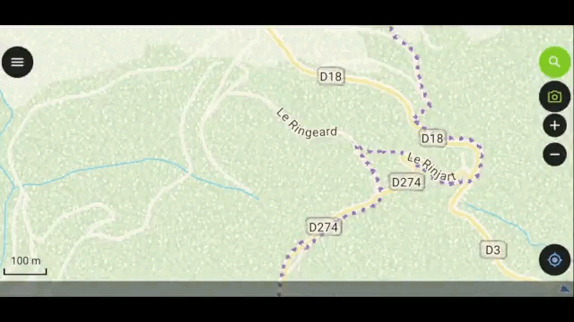

# Pl@ntNet QField Plugin

The Pl@ntNet QField Plugin is a one-click solution for adding and identifying plants from pictures directly from your device's camera using QField.
This plugin simplifies the field data collection process by allowing users to capture and attach photos to their geospatial data quickly.

This plugin is based on the excellent [QField SNAP! plugin by OPENGIS.ch](https://github.com/opengisch/qfield-snap/)

## Features
- **One-click feature addition:** Add new features with a single click.
- **Camera integration:** Automatically open the camera to take pictures and attach them to the features.
- **Streamlined workflow:** Designed specifically for QField, ensuring a smooth field data collection experience.

## Installation

1. **Download QField:**
   - Install [QField on your device](https://qfield.org/get).

2. **Install Pl@ntNet QField Plugin:**
   - See https://docs.qfield.org/how-to/plugins/

## Usage

1. **Activate the Plugin:**
   - Open QField, go to the settings panel, and open the plugin manager.
   - Ensure the `Pl@ntNet` plugin is activated.

2. **Add Features with Photos:**
   - Select the layer where you want to add a feature.
   - Click on the `Pl@ntNet` button.
   - The camera will open automatically. Take a picture of the feature.
   - The new feature will be added to the layer with the photo attached and the species attribute prefilled

## Detailed Explanation

For a detailed explanation of the code and functionality, please refer to the [blog post](https://www.opengis.ch/fr/2024/06/18/supercharge-your-fieldwork-with-qfields-project-and-app-wide-plugins/).

## Contributing

Contributions are welcome!

## Contact

If you have questions or feedback, please open an issue on our [GitHub repository](/issues).

---

Thank you for using the Pl@ntNet QField Plugin! Happy mapping!

---
